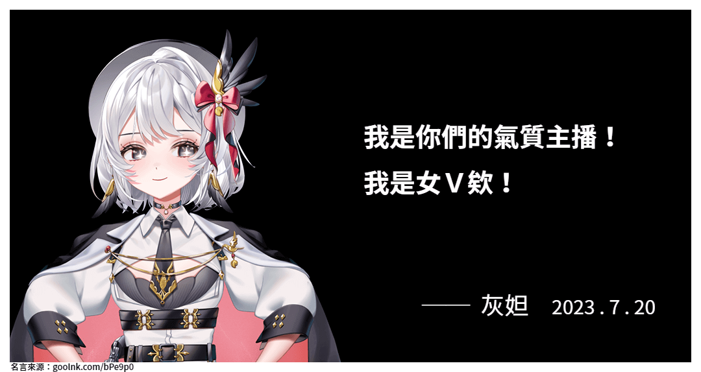

# 灰妲名言產生器

  
  

 
<figure align="center">
    
    <figcaption><small>▲灰妲名言圖(範例)</small></figcaption>
</figure>

## 關於

[灰妲名言產生器][Web-url]是一個能快速將台灣 Vtuber ── [灰妲][Dada-youtube-url] 所發表之有趣言論，快速製作成名言梗圖的網站。歡迎粉絲們多加使用！

## 如何使用

只要簡單三步驟，即可製作出灰妲的名言梗圖。

1. 輸入言論內容、言論日期(非必填)、特殊風格(非必填)。
2. 選擇名言圖立繪。選擇不同角色後，匯出時會自動匯出不同署名。
   如選擇「妲哥」立繪，則隨後匯出圖的署名，會標示「妲哥」。
3. 輸入該言論的出處連結(非必填)，如推特、Youtube 連結，其中 Youtube 連結建議附上含時間之連結，以便有興趣者查找。輸入完成後，即可點選製作名言圖按鍵，完成製作。

## 版本 1.1.0

## 開發工具

[![Vite][Vite]][Vite-url]
[![Vue][Vue]][Vue-url]
[![Javascript][Javascript]][Javascript-url]
[![Scss][Scss]][Scss-url]
[![Github-actions][Github-actions]][Github-actions-url]
[![Figma][Figma]][Figma-url]
[![Photoshop][Photoshop]][Photoshop-url]

## 圖片來源

本網站使用之圖片素材，皆取自灰妲官方非營利二創素材包，部分背景素材取自免費免版權圖庫。

[Web-url]: https://serser322.github.io/dada-quotation-generator/
[Dada-youtube-url]: https://www.youtube.com/@ReLiveDaDa
[Vite]: https://img.shields.io/badge/Vite-653bfe?style=for-the-badge&logo=vite&logoColor=FFD62E
[Vite-url]: https://vitejs.dev/
[Vue]: https://img.shields.io/badge/Vue%20js-35495E?style=for-the-badge&logo=vuedotjs&logoColor=4FC08D
[Vue-url]: https://vuejs.org/
[Javascript]: https://img.shields.io/badge/JavaScript-323330?style=for-the-badge&logo=javascript&logoColor=F7DF1E
[Javascript-url]: https://developer.mozilla.org/en-US/docs/Web/JavaScript
[Scss]: https://img.shields.io/badge/Sass-CC6699?style=for-the-badge&logo=sass&logoColor=white
[Scss-url]: https://sass-lang.com/
[Figma]: https://img.shields.io/badge/Figma-F24E1E?style=for-the-badge&logo=figma&logoColor=white
[photoshop-url]: https://www.adobe.com/tw/products/photoshop/free-trial-download.html
[Github-actions]: https://img.shields.io/badge/Github%20Actions-282a2e?style=for-the-badge&logo=githubactions&logoColor=367cfe
[Github-actions-url]: https://docs.github.com/en/actions
[Figma-url]: https://www.figma.com/
[Photoshop]: https://img.shields.io/badge/Adobe%20Photoshop-31A8FF?style=for-the-badge&logo=Adobe%20Photoshop&logoColor=black
